# UNIX/Linux operating systems

## Contents

1 [Инструмент ipcalc](#part-1-ipcalc-tool)  
2 [Статическая маршрутизация между двумя машинами](#part-2-static-routing-between-two-machines)  
3 [Утилита ipref3](#part-3-ipref3-utility)   
4 [Сетевой экран](#part-4-network-firewall)  
5 [Статическая маршрутизация сети](#part-5-static-network-routing)  
6 [Динмаическая настройка IP с помощью DHCP](#part-6-dynamic-ip-configuration-using-DHCP)  
7 [NAT](#part-7-NAT)  
8 [Дополнтельною Знакомство с SSH Tunnels](#part-8-bonus-introduction-to-ssh-tunnels)  

## Part 1. Ipcalc tool 

### 1.1 Сети и маски

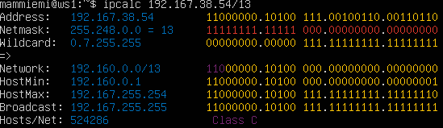

1) Адресс сети 192.167.38.54/13

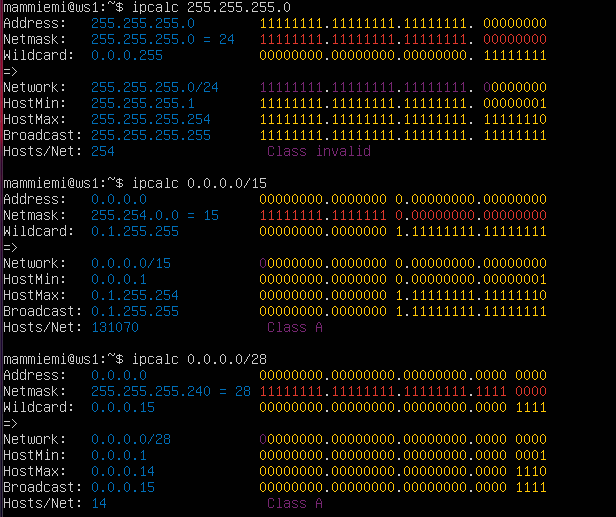

2) Перевод маски 255.255.255.0 в префиксную и двоичную запись, /15 в обычную и двоичную, 11111111.11111111.11111111.11110000 в обычную и префиксную

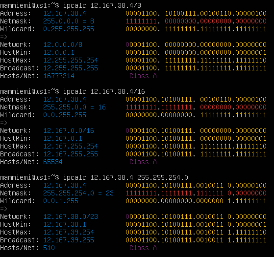

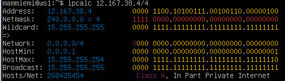

3) Минимальный и максимальный хост в сети 12.167.38.4 при масках: /8, 11111111.11111111.00000000.00000000, 255.255.254.0 и /4

### 1.2 Localhost

Определить и записать в отчёт, можно ли обратиться к приложению, работающему на localhost, со следующими IP: 194.34.23.100, 127.0.0.2, 127.1.0.1, 128.0.0.1

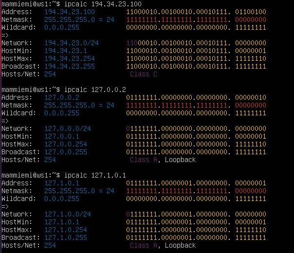

в таком случае нельзя обратиться к приложению, работающему на localhost с IP 194.34.23.100

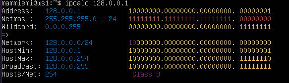

а также к приложению, работающему на localhost с IP 128.0.0.1

### 1.3. Диапазоны и сегменты сетей

Определить и записать в отчёт:

1) какие из перечисленных IP можно использовать в качестве публичного, а какие только в качестве частных: 10.0.0.45, 134.43.0.2, 192.168.4.2, 172.20.250.4, 172.0.2.1, 192.172.0.1, 172.68.0.2, 172.16.255.255, 10.10.10.10, 192.169.168.1

PRIVATE:

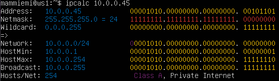

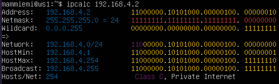

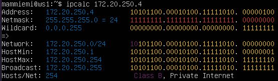

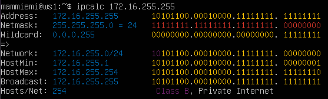

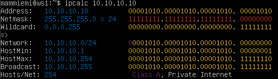

PUBLIC:

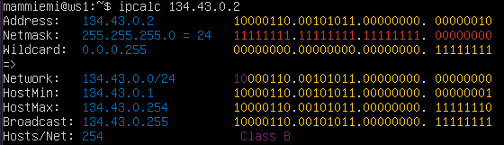

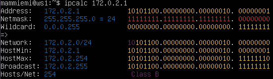

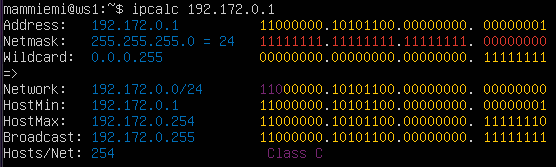

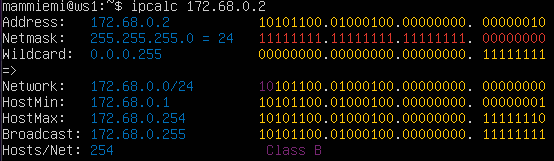

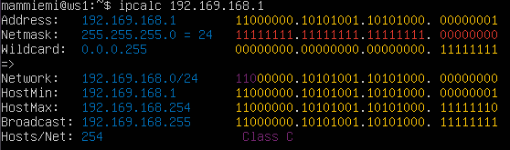

2) какие из перечисленных IP адресов шлюза возможны у сети 10.10.0.0/18: 10.0.0.1, 10.10.0.2, 10.10.10.10, 10.10.100.1, 10.10.1.255

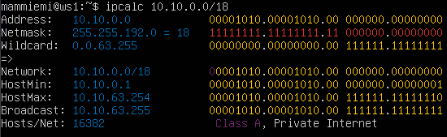

10.0.0.1 -

10.10.0.2 +

10.10.10.10 +

10.10.100.1 -

10.10.1.255 для broadcast

## Part 2. Static routing between two machines

С помощью команды ip a посмотреть существующие сетевые интерфейсы

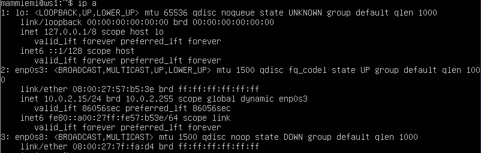

net interfaces ws1

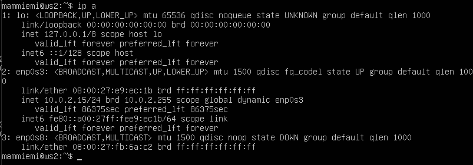

net interfaces ws2

Описать сетевой интерфейс, соответствующий внутренней сети, на обеих машинах и задать следующие адреса и маски: ws1 - 192.168.100.10, маска /16, ws2 - 172.24.116.8, маска /12

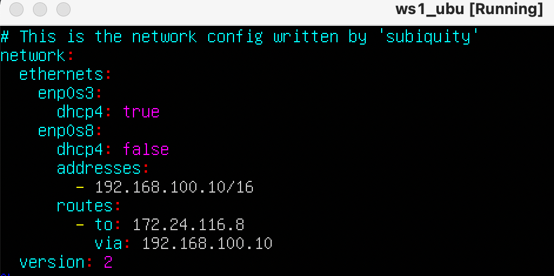

etc/netplan/00-installer-config.yaml для ws1

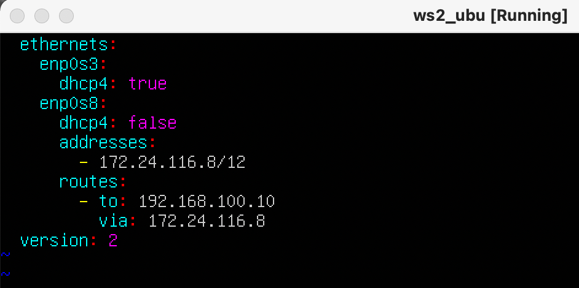

etc/netplan/00-installer-config.yaml для ws2

Выполнить команду netplan apply для перезапуска сервиса сети

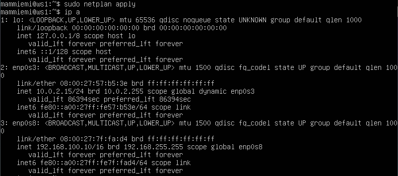

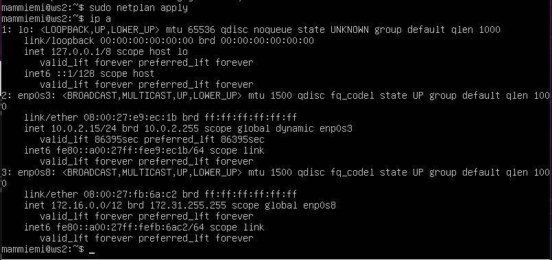

Добавить статический маршрут от одной машины до другой и обратно при помощи команды вида ip r add

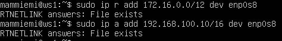

Пропинговать соединение между машинами

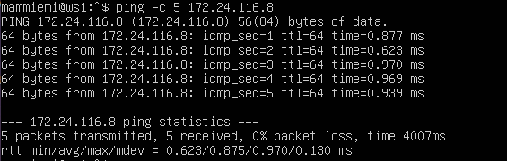

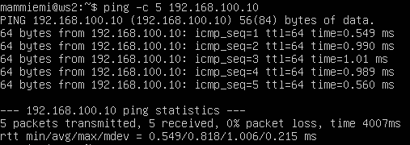

Перезапустить машины 

Добавить статический маршрут от одной машины до другой с помощью файла etc/netplan/00-installer-config.yaml

для ws1

для ws2

## Part 3. Iperf3 utility
1. Узнаем текущее название машины следующей командой: 

        $hostnamectl

2. Чтобы изменить имя пользователя воспользуемся командой:

        $sudo hostnamectl set-hostname <new_name> 

3. Текущий часовой пояс можно просмотреть командой:

        $timedatectl
    

4. Изменение часового пояса:

        $sudo timedatectl set-timezone Europe/Moscow

5. Сетевые интерфейсы выводятся командой 

        $ip link show

__loopback__ - это официальный стандарт, неотъемлемая часть _unix/linux_ системы, не важно, серверной или настольной. нужен для работы многих приложений, для тестирования итд.
Интерфейс __lo__ - интерфейс обратной петли и позволяет компьютеру обращатся к самому себе. Интерфейс имеет ip-адрес 127.0.0.1 и необходим для нормальной работы системы.

6. Чтобы получить IP адрес устройства от DHPC сервера:
    
На скриншоте ниже видно, что IP интерфейсу присвоен динамически, т.к. в выводе присутствует аббр. _DHCP_:

     $ip r

Соответственно если в выводе данная аббр. отсутствует — это будет означать, что _IP_ статический. Данный метод проверки подойдет особенно тогда, когда подключение к компьютеру производится удаленно, т.к. действие осуществляется из командной строки. 

Используя консольную команду получить _IP_ адрес устройства, на котором вы работаете, от _DHCP_ сервера.

7. Bнутренний _IP_-адрес шлюза, он же _ip_-адрес по умолчанию (gw):

        $routel | grep default
    Его также можно узанть командой "__ip r__" но сейчас используем команду которая укажет только то, что нужно:

8. внешний _ip_-адрес шлюза:

       $wget -qO- ipinfi.io/ip

9. Задание статичных данных:

        $sudo vim /etc/netplan/00-installer-config.yaml

10. после изменений пропингуем удаленные хосты _1.1.1.1_ и _ya.ru_:

        $ping <address>

флаг "_-c_" позволит указать точное количество отправленных пакетов.

## Part 4. Network firewall

    $sudo apt-get update
    $sudo apt-get dist-upgrade

Для обновления всех установленных пакетов используется команда _apt-get_ upgrade. Она позволяет обновить те и только те установленные пакеты, для которых в репозиториях, перечисленных в _/etc/apt/sources.list_, имеются новые версии; при этом из системы не будут удалены никакие другие пакеты.

## Part 5. Static network routing

Команда ___sudo___ _(substitute user and do, подменить пользователя и выполнить)_ позволяет строго определенным пользователям выполнять указанные программы с административными привилегиями без ввода пароля суперпользователя root. Если быть точнее, то команда _sudo_ позволяет выполнять программы от имени любого пользователя, но, если идентификатор или имя этого пользователя не указаны, то предполагается выполнение от имени суперпользователя root. Таким образом, использование _sudo_ позволяет выполнять привилегированные команды обычным пользователям без необходимости ввода пароля суперпользователя _root_ . Список пользователей и перечень их прав по отношению к ресурсам системы может быть настроен оптимальным образом для обеспечения комфортной и безопасной работы. Например, команда sudo в _Ubuntu Linux_, используется в режиме, позволяющем

    $sudo usermod -aG sudo testuser

C помощью команды следующей команды перейдем на аккаунт пользователя _mam_adm_:

    $su "user_name"

На скрине ниже с помощью команды hostnamectl видим что текущее имя хоста "_s21lolpc_".
Изменим hostname c помощью 
        
        $ sudo hostnamectl set-hostname <new-name> 

Успешное изменение именя _localhost_ свидетельствует о том что пользователю  _mam_adm_ были выданы права sudo.

## Part 6. Dynamic IP configuration using DHCP

    $sudo apt install ntp

Если вам необходимо только синхронизировать время, то утилиты _timesyncd_ вполне хватает для этой простой задачи. Но иногда вам нужен более широкий функционал. Например, вы хотите настроить в своей локальной сети свой собственный сервер времени, чтобы остальные компьютеры сверяли свои часы с ним. В этом случае вам нужна будет служба ntp. А раз вы ее и так поставите, то зачем вам дублирование функционала? В этом случае имеет смысл отключить _timesyncd_ и оставить только _ntp_. Она умеет работать и в качестве сервера времени, и в качестве клиента синхронизации.

    $sudo systemctl enable --now ntp

Проверяем статус синхронизации:

    $timedatectl show

## Part 7. NAT

Для скачивания текстовых редакторов используем команду:

    $sudo apt install <program_name>

Созданные файлы:

Чтобы сохранить сделанные изменения, нажмите _Ctrl+O_. Для выхода из nano нажмите _Ctrl+X_. Если вы выходите из редактора, а файл изменен, nano предложит сохранить файл. Чтобы отказаться от сохранения, просто нажмите _N_, а для подтверждения — _Y_. Редактор запросит имя файла. Просто введите имя, а затем нажмите Enter.

Нажмите клавишу _Esc_, это важно, потому что вам необходимо выйти из режима вставки, прежде чем вводить команды выхода. Далее можете вести одну из следующих команд:

* :q - выйти;
* :q! - выйти принудительно;
* :wq - позволяет сохранить и выйти Vim.

В таблицы внизу редактора mcedit указаны основные команды. Сохранение - _F2_, Выход _F10_.

Редактирование без сохранения изменений:

Чтобы выйти не сохраняя изменения следует нажать комбинацию клавиш _Ctrl+X_, затем отказаться от сохранения нажав клавишу _N_.

Нажмите клавишу _Esc_. Далее "_:q!_" - выйти не сохраняя изменения;

Чтобы выйти из _MCEDIT_ нажмите _F10_ затем стрелочками переключитесь на ячейку "_no_", чтобы отказаться от сохранения.

Как видим содержимое файлов дейсвтительно не изменилось.

---

NANO

Чтобы в редакторе nano выполнить поиск и замену текста используется сочетание клавиш "_Ctrl+\\_".

Нажимте _Ctrl+\\_, введите строку, которую необходимо искать и нажмите клавишу Enter. Затем введите строку, на которую произвести замену и нажмите Enter.

После этого появится предложение по замене первого вхождения вашей строки. Вы можете нажать:
_A_ — Выполнить автоматическую замену всех вхождений строки.
_Y_ — Выполнить замену данной найденной строки (после этого вы переместитесь к следующему в хождению искомой строки).
_N_ — Отменить замену данной строки (после этого вы переместитесь к следующему в хождению искомой строки).
_Ctrl+C_ — Прервать поиск.

До:

После: 

 VIM

Общая форма команды замены следующая:

    :[range]s/{pattern}/{string}/[flags] [count]
 

Команда ищет в каждой строке _[range]_ a _{pattern}_ и заменяет ее на _{string}_. _[count]_ — положительное целое число, умножающее команду.

Если нет _[range]_ и _[count]_, заменяется только шаблон, найденный в текущей строке. Текущая строка — это строка, в которой находится курсор.

Например, чтобы найти первое вхождение строки _‘foo’_ в текущей строке и заменить его на _‘bar’_, вы должны использовать:

    :s/foo/bar/
 

Чтобы заменить все вхождения шаблона поиска в текущей строке, добавьте флаг "_g_":

    :s/foo/bar/g
 

Если вы хотите найти и заменить шаблон во всем файле, используйте символ процента _%_ в качестве диапазона. Этот символ указывает диапазон от первой до последней строки файла:

    :%s/foo/bar/g

До:

После:

---

 MCEDIT

В _MCEDIT_ для того чтобы заменить текст сначала следует нажать клавишу _F7_ для поиска нужных строк/паттернов, после чего нажамать клавишу _F4_ для указания параметров замены текста

До:

После:

## Part 8. Bonus. Introduction to SSH Tunnels

Обновим репозиторий 

    $sudo apt update

Установим  SSH

    $sudo apt-get install ssh

Установим  OpenSSH

    $sudo apt install openssh-server

Добавим пакет SSH-сервера в автозагрузку:

    $sudo systemctl enable ssh

Открываем порт 2022

    $sudo vim /etc/ssh/sshd_config

Перезагрузим сервис

    $sudo systemctl restart sshd

* _netstat_ - служит для отображения состояния сетевого интрфейса.
* _flag t_ - показать _TCP_ соединения.
* _flag a_ - вывод всех активных подключений _TCP_.
* _flag n_ - для отображения _IP_ адресов вместо имен хостов.
* _Proto_ - имя протокола.
* _Recv-Q_ - данные в буфере приема _TCP/IP_.
* _Send-Q_ - данные в буфере отправки _TCP/IP_.
* _Local Adress_ - локальный _IP_ адрес.
* _Foreign Adress_ - внешний _IP_ адрес.
* _State_ - прослушивается порт или нет.

* [В начало](#contents)
