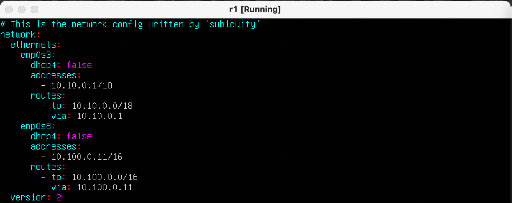
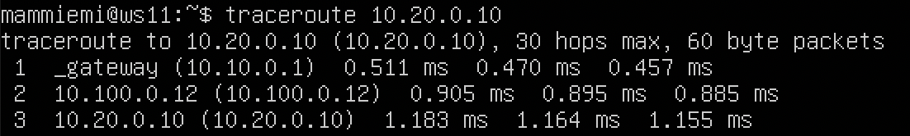
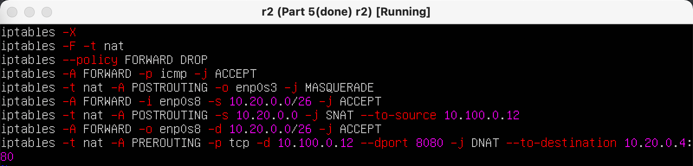

# UNIX/Linux operating systems

## Contents

1 [Инструмент ipcalc](#part-1-ipcalc-tool)  
2 [Статическая маршрутизация между двумя машинами](#part-2-static-routing-between-two-machines)  
3 [Утилита ipref3](#part-3-ipref3-utility)   
4 [Сетевой экран](#part-4-network-firewall)  
5 [Статическая маршрутизация сети](#part-5-static-network-routing)  
6 [Динмаическая настройка IP с помощью DHCP](#part-6-dynamic-ip-configuration-using-DHCP)  
7 [NAT](#part-7-NAT)  
8 [Дополнтельною Знакомство с SSH Tunnels](#part-8-bonus-introduction-to-ssh-tunnels)  

## Part 1. Ipcalc tool 

### 1.1 Сети и маски

1) Адресс сети 192.167.38.54/13

2) Перевод маски 255.255.255.0 в префиксную и двоичную запись, /15 в обычную и двоичную, 11111111.11111111.11111111.11110000 в обычную и префиксную

3) Минимальный и максимальный хост в сети 12.167.38.4 при масках: /8, 11111111.11111111.00000000.00000000, 255.255.254.0 и /4

### 1.2 Localhost

Определить и записать в отчёт, можно ли обратиться к приложению, работающему на localhost, со следующими IP: 194.34.23.100, 127.0.0.2, 127.1.0.1, 128.0.0.1

в таком случае нельзя обратиться к приложению, работающему на localhost с IP 194.34.23.100

а также к приложению, работающему на localhost с IP 128.0.0.1

### 1.3. Диапазоны и сегменты сетей

Определить и записать в отчёт:

1) какие из перечисленных IP можно использовать в качестве публичного, а какие только в качестве частных: 10.0.0.45, 134.43.0.2, 192.168.4.2, 172.20.250.4, 172.0.2.1, 192.172.0.1, 172.68.0.2, 172.16.255.255, 10.10.10.10, 192.169.168.1

PRIVATE:

PUBLIC:

2) какие из перечисленных IP адресов шлюза возможны у сети 10.10.0.0/18: 10.0.0.1, 10.10.0.2, 10.10.10.10, 10.10.100.1, 10.10.1.255

10.0.0.1 -

10.10.0.2 +

10.10.10.10 +

10.10.100.1 -

10.10.1.255 +

## Part 2. Static routing between two machines

С помощью команды ip a посмотреть существующие сетевые интерфейсы

net interfaces ws1

net interfaces ws2

Описать сетевой интерфейс, соответствующий внутренней сети, на обеих машинах и задать следующие адреса и маски: ws1 - 192.168.100.10, маска /16, ws2 - 172.24.116.8, маска /12

etc/netplan/00-installer-config.yaml для ws1

etc/netplan/00-installer-config.yaml для ws2

Выполнить команду netplan apply для перезапуска сервиса сети

Добавить статический маршрут от одной машины до другой и обратно при помощи команды вида ip r add

Пропинговать соединение между машинами

Перезапустить машины 

Добавить статический маршрут от одной машины до другой с помощью файла etc/netplan/00-installer-config.yaml

для ws1

для ws2

Пропинговать соединение между машинами

Пинг с ws1 до ws2

Пинг с ws2 до ws1

## Part 3. Iperf3 utility

3.1 Скорость соединения
    
    8 Mbps = 1 MB/s
    100 Mbps = 100000 kbps
    1 Gbps = 1000 Mbps

3.2 Утилита iperf3

Измерить скорость соединения между ws1 и ws2

Для измерения скорости запустим ws2 как сервер, клиентом будет выступать ws1

И аналогично обратная ситуация ws1 - сервер ws2 - клиент

## Part 4. Network firewall

4.1 Утилита iptables

Создать файл /etc/firewall.sh, имитирующий фаерволл, на ws1 и ws2:

ws1:

ws2:

Запустить файлы на обеих машинах командами chmod +x /etc/firewall.sh и /etc/firewall.sh

ws1:

ws2:

Применены нормально закрытая и нормально открытая стратегии, в одной запрщено все, кроме конкретно разрешенных сервисов, во второй разрешено все, кроме конкретно запрещенных сервисов 

4.2. Утилита nmap

Командой ping найти машину, которая не "пингуется"

ws1 to ws2:

ws2 to ws1:

Утилитой nmap показать, что хост машины запущен:

## Part 5. Static network routing

Поднять пять виртуальных машин (3 рабочие станции (ws11, ws21, ws22) и 2 роутера (r1, r2))

5.1. Настройка адресов машин

Настроить конфигурации машин в etc/netplan/00-installer-config.yaml

ws11:

r1:

r2:

ws21:

ws22:

Перезапустить сервис сети. Если ошибок нет, то командой ip -4 a проверить, что адрес машины задан верно. Также пропинговать ws22 с ws21. Аналогично пропинговать r1 с ws11.

ws21:

ws22:

r2:

r1:

ws11:

5.2. Включение переадресации IP-адресов.

Для включения переадресации IP, выполните команду на роутерах:

    sudo sysctl -w net.ipv4.ip_forward=1

r1:

r2:

Откройте файл /etc/sysctl.conf и добавьте в него следующую строку:

    net.ipv4.ip_forward = 1

r1:

r2:

Настроить маршрут по-умолчанию (шлюз) для рабочих станций. Для этого добавить gateway4 [ip роутера] в файле конфигураций

Вызвать ip r и показать, что добавился маршрут в таблицу маршрутизации

ws11:

Пропинговать с ws11 роутер r2 и показать на r2, что пинг доходит. Для этого использовать команду:

    tcpdump -tn -i eth1

5.4. Добавление статических маршрутов

Добавить в роутеры r1 и r2 статические маршруты в файле конфигураций. 

Вызвать ip r и показать таблицы с маршрутами на обоих роутерах. 

Запустить команды на ws11:

    ip r list 10.10.0.0/[маска сети] и ip r list 0.0.0.0/0

5.5. Построение списка маршрутизаторов

Запустить на r1 команду дампа:

    tcpdump -tnv -i eth0

При помощи утилиты traceroute построить список маршрутизаторов на пути от ws11 до ws21

Исходя из дампа на r1 мы видим, что пакеты прошли по трем узлам:

Через прописанный нами шлюз(10.10.0.1) дальше роутер r2(10.100.0.12) и рабочая станция ws21(10.20.0.10)

5.6. Использование протокола ICMP при маршрутизации

Запустить на r1 перехват сетевого трафика, проходящего через eth0 с помощью команды:
    
    tcpdump -n -i eth0 icmp

Пропинговать с ws11 несуществующий IP (например, 10.30.0.111) с помощью команды:
    
    ping -c 1 10.30.0.111

## Part 6. Dynamic IP configuration using DHCP

Для r2 настроить в файле /etc/dhcp/dhcpd.conf конфигурацию службы DHCP:

1) указать адрес маршрутизатора по-умолчанию, DNS-сервер и адрес внутренней сети:

2) в файле resolv.conf прописать nameserver 8.8.8.8

Перезагрузить службу DHCP командой systemctl restart isc-dhcp-server. Машину ws21 перезагрузить при помощи reboot и через ip a показать, что она получила адрес. Также пропинговать ws22 с ws21.

Указать MAC адрес у ws11, для этого в etc/netplan/00-installer-config.yaml надо добавить строки: macaddress: 10:10:10:10:10:BA, dhcp4: true

Для r1 настроить аналогично r2, но сделать выдачу адресов с жесткой привязкой к MAC-адресу (ws11). Провести аналогичные тесты

Запросить с ws21 обновление ip адреса

## Part 7. NAT

В файле /etc/apache2/ports.conf на ws22 и r1 изменить строку Listen 80 на Listen 0.0.0.0:80, то есть сделать сервер Apache2 общедоступным

Добавить в фаервол, созданный по аналогии с фаерволом из Части 4, на r2:

Проверить соединение между ws22 и r1 командой ping
При запуске файла с этими правилами, ws22 не должна "пинговаться" с r1

Разрешить маршрутизацию всех пакетов протокола ICMP

Проверить соединение между ws22 и r1 командой ping

Добавить в файл ещё два правила:

Включить SNAT, а именно маскирование всех локальных ip из локальной сети, находящейся за r2 (по обозначениям из Части 5 - сеть 10.20.0.0)

Включить DNAT на 8080 порт машины r2 и добавить к веб-серверу Apache, запущенному на ws22, доступ извне сети

Проверить соединение по TCP для SNAT

Проверить соединение по TCP для DNAT

## Part 8. Bonus. Introduction to SSH Tunnels

* [В начало](#contents)

Запустить веб-сервер Apache на ws22 только на localhost 

Воспользоваться Local TCP forwarding с ws21 до ws22, чтобы получить доступ к веб-серверу на ws22 с ws21

Воспользоваться Remote TCP forwarding c ws11 до ws22, чтобы получить доступ к веб-серверу на ws22 с ws11, выполните команду

    telnet 127.0.0.1 [локальный порт]

